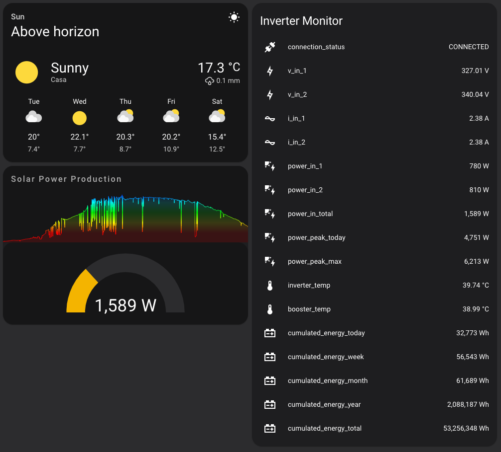

# ESPHome - Aurora Inverter Monitor

This project aims the integration between Power-One (ABB) Aurora Inverters and [ESPHome](https://esphome.io/index.html) using an ESP8266/ESP32 board.

The communication runs over the RS485 interface of the Inverter using a [TTL-to-RS485 moudule](https://www.bizkit.ru/en/2019/02/21/12563/).
The module is attached to the ESP board using the pins declared in [InverterMonitor.h](./InverterMonitor.h#L10):

    #define RX 14               //GPIO14
    #define TX 27               //GPIO27
    #define TX_CONTROL_GPIO 26  //GPIO26

The [Aurora Communication Protocol](https://www.drhack.it/images/PDF/AuroraCommunicationProtocol_4_2.pdf) used in the communication is handled by the [jrbenito/ABBAurora](https://github.com/jrbenito/ABBAurora) library.
  
## ESPHome Sensors
This Inverter Monitor exploits the communication library to expose some of the available inverter's data:
| Sensor name            | Unit of measurement | Accuracy decimals |
|------------------------|:-------------------:|:-----------------:|
| v_in_1                 |          V          |         2         |
| v_in_2                 |          V          |         2         |
| i_in_1                 |          A          |         2         |
| i_in_2                 |          A          |         2         |
| power_in_1             |          W          |         0         |
| power_in_2             |          W          |         0         |
| power_in_total         |          W          |         0         |
| power_peak_today       |          W          |         0         |
| power_peak_max         |          W          |         0         |
| inverter_temp          |          °C         |         2         |
| booster_temp           |          °C         |         2         |
| cumulated_energy_today |          Wh         |         0         |
| cumulated_energy_week  |          Wh         |         0         |
| cumulated_energy_month |          Wh         |         0         |
| cumulated_energy_year  |          Wh         |         0         |
| cumulated_energy_total |          Wh         |         0         |

> **_NOTE:_**  `power_in_total` is the sum of `power_in_1` and `power_in_2` values.

More sensors can be created based on the [DSP_VALUE_TYPE](./ABBAuroraEnums.h#L5) enum values.

An additional text_sensor named `connection_status` is exposed to monitor the connection between the ESP and the inverter.
  

## Building and Flashing 
The full guide of the `esphome` ccommand line interface can be found in the [ESPHome documentation](https://esphome.io/guides/getting_started_command_line.html).

### Installing ESPhome cli
> pip3 install esphome

### Generating and compiling the source code
> esphome config.yaml compile

### Uploading the binary to the ESP device
> esphome config.yaml upload
